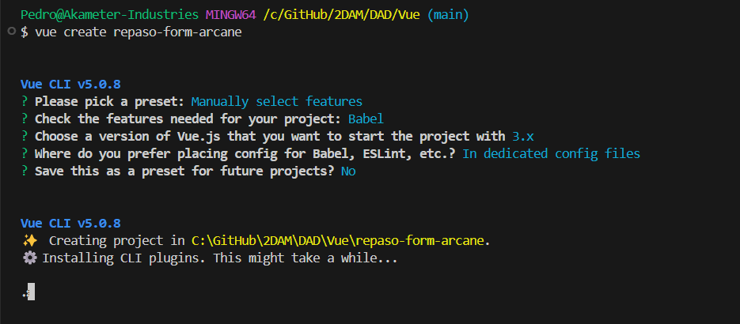
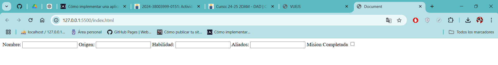
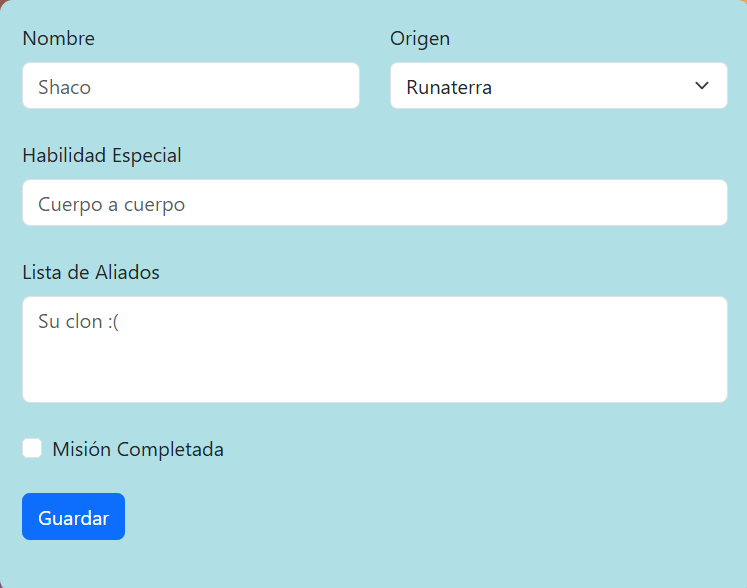
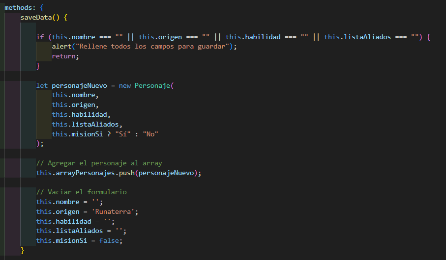
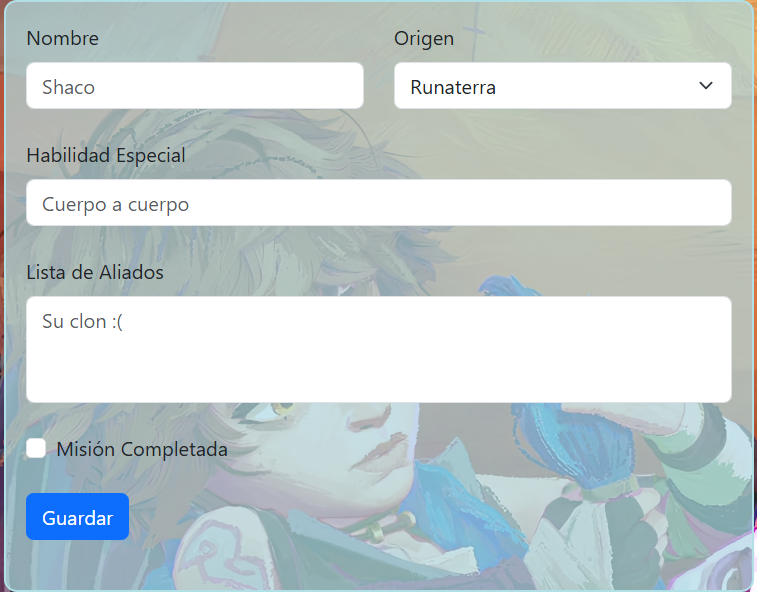
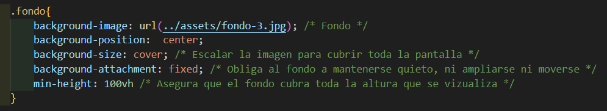

<div align=justify>

# Actividad de Repaso de Vue: Formulario de Arcane

Este es el repositorio en el que será realizada la tarea de repaso de la asignatura de Desarrollo de Interfaces (DAD).

__Deploy__: [Formulario Arcane](https://petermartesc.github.io/arcane-form/)

## Objetivo

Recordar y trabajar lo aprendido sobre el framework de Vue. 

### Instrucciones

#### 1. - Diseña y desarrolla una aplicación en VueJS con un componente único que cumpla con las siguientes funcionalidades:

- __Formulario para añadir personajes de Arcane__:

    - Permite registrar un personaje ingresando:
        - __Nombre__ (Ejemplo: "Jinx", "Vi")
        - __Origen__ (Ejemplo: "Píltover", "Zaun")
        - __Habilidad especial__ (Ejemplo: "Manipulación de explosivos", "Combate cuerpo a cuerpo")
        - __Lista de aliados__ (Ejemplo: "Ekko", "Caitlyn")
        - __Checkbox__ que indique si el personaje ha cumplido su misión principal.
        
    - __Tabla de visualización de personajess registrados__:
        - Muestra todos los personajes registrados en el sistema, incluyendo todos los datos ingresados desde el formulario.


#### 2. - Requisitos:

- Realiza toda la gestión de datos de manera __volátil__, es decir, sin conexión con APIs ni bases de datos. Los datos se gestionarán directamente en el estado del componente.

- Usa un único componente para combinar las funcionalidades del formulario y la tabla.

- __Haz uso de las directivas necesarias__ que hemos visto en clase para gestionar la interacción y el comportamiento de los elementos del componente.

- Consulta la __documentación disponible en el campus__ como referencia para la implementación.

- Utiliza __Bootstrap__ para proporcionar un diseño visual más atractivo y estructurado a la aplicación.
- La aplicación deberá ser desarrollada utilizando una de las dos formas vistas en clase: __Composition API__ o __Option API__.

#### 3. - Simplificaciones para esta versión del ejercicio:

- No se requiere separar las funcionalidades en componentes adicionales, todo debe implementarse dentro de un único componente.
- El sistema no requiere persistencia de datos ni funcionalidades avanzadas, solo debe manejar los datos de manera local dentro del componente.

> Nota: Este ejercicio sirve como base. Más adelante, añadiremos componentes adicionales y funcionalidades más avanzadas.

> Recuerda comenzar un nuevo proyecto usando vue-cli y usando la opción por defecto Vue 3, Babel y Lint.

#### Enlaces con información sobre personajes de arcane: 

1. [Wiki](https://leagueoflegends.fandom.com/es/wiki/Arcane_(serie_de_televisi%C3%B3n)#Personajes)

2. [Guía de Personajes](https://www.redbull.com/es-es/arcane-guia-personajes-de-league-of-legends)

3. [Fandom Wiki](https://leagueoflegends.fandom.com/wiki/Category:Characters_in_Arcane_(TV_Series))

### Realización 

A continuación explicaré el proceso de realización de la tarea.

Inicialmente, creé el proyecto con:

```bash
    vue create repaso-form-arcane
```
siguiendo la esta configuración:

<p align="center">
    
</p>

Como se especifica en las instrucciones, podíamos elegir entre la __Composition API__ u __Option API__. Yo elegí la __Option API__ debido a varios factores. Según nos explicó la profesora, es la mejor opción para aplicaciones pequeñas, ya que su escalabilidad es limitada, y también es ideal para nuevos desarrolladores en Vue. 

Aparte de lo mencionado, la __Option API__ también se caracteriza por tener una estructura basada en opciones. El código se organiza en opciones específicas dentro de un objeto exportado, como `data`, `methods`, `computed`, `watch`, `props`, etc.

Luego de elegir la estructura del proyecto, procedí a crear el formulario. Primero realicé uno con un diseño más simple para hacerme una idea

<p align="center">
    
</p>

pero al poco tiempo, decidí aplicarle __Bootstrap__ para tener un diseño más bonito. Además, decidí cambiar el input de `origen` por un selector, y eliminé el otro checkbox que había (estaba establecido un check para si la misión estaba completata y otro para si no, pero no tenía sentido. Si se marcaba el de si, estaba completada y si no, no lo estaba)

<p align="center">
    
</p>
Luego me puse con el código. Tuve varias complicaciones, ya que hacía tiempo que no trabajaba en JavaScript puro, pero como no iba a crear el proyecto de nuevo desde 0 para hacerlo con Typescript, decidí seguirlo en Javascript. 

El primer problema fue al intentar tomar los datos del formulario. Era una acción que nunca había realizaco con Vue y menos con la __Option API__, entonces acabé recurriendo a `document.getElementById()`

```code
saveData() {
                
                let nombreGuardar = document.getElementById("nombre").value;
                let origenGuardar = document.getElementById("origen").value;
                let habilidadGuardar = document.getElementById("habilidad").value;
                let listaAliadosGuardar = document.getElementById("listaAliados").value;
                let misionSi = document.getElementById("misionSi").checked ? "Sí" : "No";

                if(nombreGuardar === "" || origenGuardar === "" || habilidadGuardar === "" || listaAliadosGuardar === ""){
                    alert("Rellene todos los campos para guardar");
                    return;
                }

                let personajeNuevo = new Personaje(
                    nombreGuardar,
                    origenGuardar,
                    habilidadGuardar,
                    listaAliadosGuardar,
                    misionSi,
                );

                // Agregar el personaje al array
                this.arrayPersonajes.push(personajeNuevo);

                // Vaciar el formulario
                document.getElementById("nombre").value = "";
                document.getElementById("origen").value = "";
                document.getElementById("habilidad").value = "";
                document.getElementById("listaAliados").value = "";
                document.getElementById("misionSi").checked = false;

                //console.log("Personaje agregado:", nuevoPersonaje);
            }
```

Más adelante, me di cuenta (gracias a preguntar ciertas dudas) que sería más sencillo, y que se implementaría mejor con __Vue__, utilizar el `v-model` en el formulario para relacionar los datos. Cada elemento en el formulario, está relacionado con una variable en específico. Cuando se escribe en los campos, se les da valor a estas variables, y en el submit se comprueban que estén todas rellenas, luego crea un objeto Personaje con los valores nuevos, le hace un push al array, vacía los campos (excepto el de origen, que por defecto es `Runaterra` y el de misiónSi que es false)

<p align="center">
    
</p>

Durante finalizando la tarea, quise añadir ciertos detalles al estilo. Añadí un fondo a la página, para darle más color y un diseño diferente. Sin embargo, no lograba que se acoplara correctamente a la página, siempre quedaba cubierta la parte central del fondo (obviamente debido a que tenía un formulario en el centro de la página).

Probé a añadir un botón para cambiar el color del formulario de fomra que quedase completamente transparente, pero era un lío innecesario, y no lograba convencerme. 

Finalmente, en un momento de lucidez, decidí meterle `0.7` de transparencia al color del formulario, y resultó ser la mejor opción.

<p align="center">
    
</p>

También tuve algún que otro problema de formato con el fondo. Tenerlo centrado, que no se ampliara cuando se añade contenido a la tabla, que no se muestren zonas blancas. Todo eso lo solucioné dandole unas propiedades al estilo (están comentadas al final del componente).

<p align="center">
    
</p>

</div>